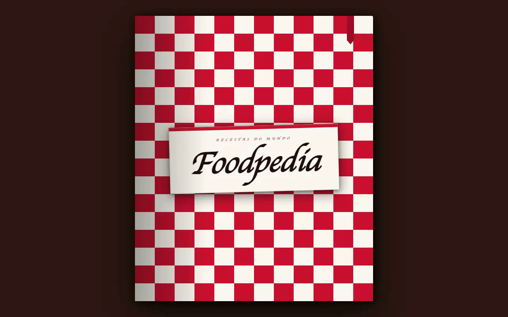
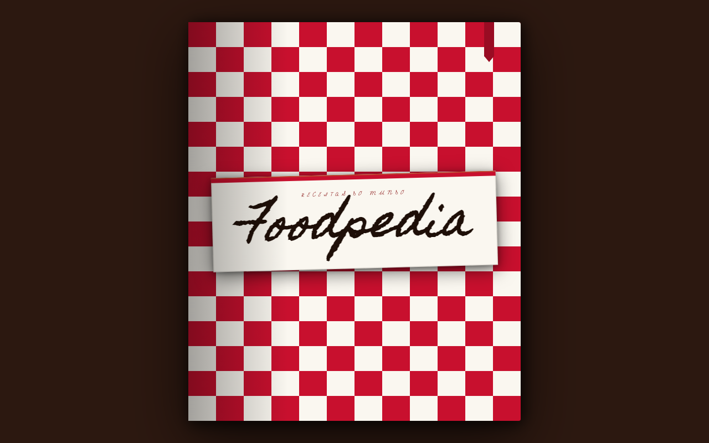
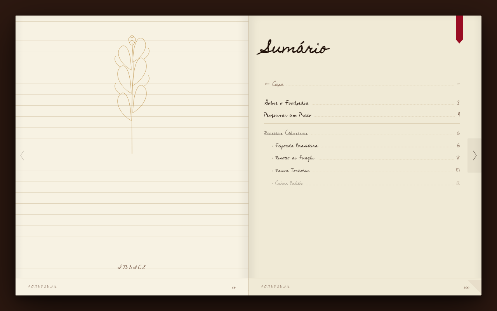
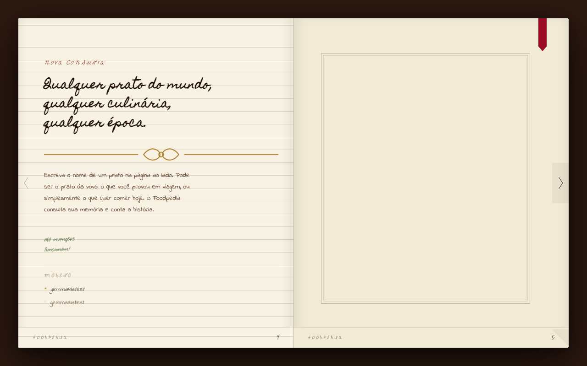
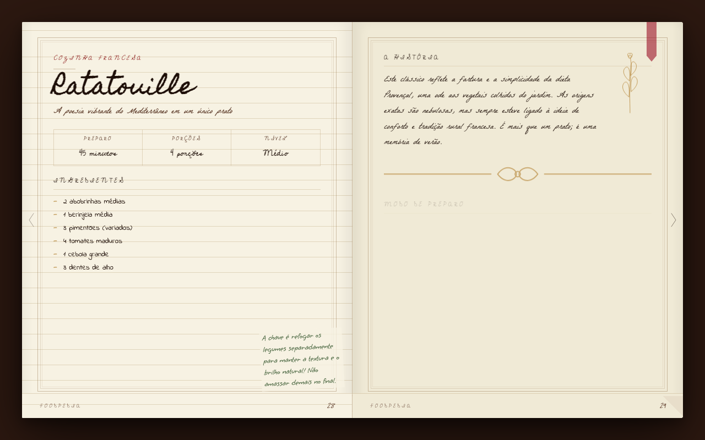

<div align="center">

<h1>Foodpedia</h1>

<p>
  <a href="#english">🇺🇸 English</a> &nbsp;·&nbsp;
  <a href="#português">🇧🇷 Português</a>
</p>


</div>

---

<h2 id="english">🇺🇸 English</h2>

### What is it

Foodpedia is a culinary encyclopedia powered by a locally-running language model.
It answers one question: **what if a recipe app actually felt like opening a cookbook?**

Not a list of cards. Not a search result page. A physical book — with a cloth cover
that swings open, pages that turn under your hand, and typographic decisions borrowed
from culinary publishing. The AI is local, runs offline, and never sends a query to the cloud.



---

### Why it's different

Three constraints shaped every decision in this project:

**1. Local AI — no cloud, no API keys, no cost per query**
Every query runs through `gemma3:latest` via Ollama, a local inference runtime.
Your data never leaves your machine. The model is selectable from the search page UI —
switch between any model installed locally without touching a config file.
Works completely offline once set up.

**2. Physical craft — a web app that behaves like a printed object**
The book has sixteen "spreads" living simultaneously in the DOM.
GSAP choreographs the cover opening, page turns, and content stagger with
easing curves borrowed from the physics of paper — not the defaults of CSS.
Typography spans five generations of handwriting: Homemade Apple for original print titles,
La Belle Aurore for literary passages, Indie Flower for body text,
Cedarville Cursive for catalogued labels and metadata, Grape Nuts for margin annotations.

**3. Opinionated stack — deliberate choices over convention**
Flask serves a single Jinja2 template. Vanilla JS handles all interaction.
No framework, no build step, no hydration. The reasoning is in the section below.

---

### The experience

1. A red-and-white gingham book cover fills the viewport. Click to open.
2. The cover swings open with a `power4.out` easing that simulates cloth weight.
3. An introduction spread, a title page, a table of contents with clickable chapter links, and an About spread.
4. Ten curated classic recipes from world cuisines, browsable as physical book pages.
5. On the search spread, the user writes a dish name into an input styled with `Homemade Apple`. A model selector lists every locally installed Ollama model.
6. Press Enter. The classic recipes become browsable while Ollama processes — the user turns pages manually, like waiting at a bookshelf.
7. When inference completes, the ribbon bookmark pulses. The next page turn the user initiates reveals the result.
8. The result spread shows: dish name, origin story, metadata grid, ingredient list, numbered steps, botanical SVG illustration, and a handwritten chef's tip.
9. At the very end, turning past the last page reveals the back cover — the book closes itself to the front.

---

### Technical decisions

These are the choices that were deliberate, not defaults.

#### Flask + Jinja2 + Vanilla JS over a modern framework

The book experience is a **DOM choreography problem**, not a component tree problem.
All sixteen spreads live in the DOM at load time. GSAP moves between them by
toggling visibility and running Timeline sequences. Adding a framework would introduce
hydration overhead, a reconciler between GSAP and the DOM, and a build pipeline —
three things that work against direct, frame-precise animation control.
Flask renders the full book structure server-side. The JS has nothing to build.

#### GSAP instead of CSS transitions for page turns

A page turn requires two distinct easing curves **in sequence**:
`power2.in` as the paper lifts (acceleration) and `power2.out` as it settles
(deceleration). CSS `transition` applies a single easing to a property change —
you cannot chain two curves on the same property without JavaScript.
GSAP Timeline makes this a three-line operation and gives millisecond-level
control over when the "other side" of the page becomes visible.

#### No food photography

Fetching photos from an external API introduces: a third-party dependency, a rate
limit, an API key, internet requirement, and a visual register that clashes with
the editorial typographic aesthetic. Stroke-only botanical SVG illustrations —
keyed to recipe category — load instantly, render consistently across any screen,
require no network access, and look like they belong in the same publication as
the Homemade Apple headings.

#### Loading as browsing

When Ollama is processing a query, most apps show a spinner. Foodpedia shows
ten curated classic recipes that the user browses by turning pages manually.
This isn't a distraction pattern — it's the app doing useful work while inference
runs. The model typically finishes within one or two page turns on modern hardware.
When it does, a visual signal appears and the next turn the user initiates
reveals the result.

#### Local AI as a first-class architectural constraint

Choosing Ollama meant the app works with zero ongoing cost, zero data exposure,
and zero dependency on external service availability. It also meant the "loading"
problem above had to be solved creatively — a cloud API would respond in under
a second; a local model takes 5–30 seconds depending on hardware. That constraint
is what created the browsing-while-waiting mechanic.

#### Five-font typography as narrative

Most web apps use two fonts at most. Foodpedia uses five — each assigned to a
distinct voice in the book. Homemade Apple is the original printer. La Belle Aurore
is the literary annotator. Indie Flower is the home cook. Cedarville Cursive
is the meticulous cataloguer. Grape Nuts is whoever scribbled in the margins.
The constraint that each font serves only one semantic role means the typography
reinforces content hierarchy without a single line of font-weight or font-size override.

---

### Stack

| Layer | Technology | Why |
|-------|------------|-----|
| Backend | Python + Flask | Thin server layer; keeps AI calls server-side |
| Templating | Jinja2 | Server renders full book DOM at load |
| AI Inference | Ollama (`gemma3:latest`) | Local, private, no API key |
| Animation | GSAP 3.12 (CDN) | Timeline control for physical book physics |
| Frontend | Vanilla JS | Direct DOM access; no framework overhead |
| Styling | CSS Custom Properties | Design tokens without build tooling |
| Typography | Google Fonts | Homemade Apple · La Belle Aurore · Indie Flower · Cedarville Cursive · Grape Nuts |

---

### Getting started

**Prerequisites**
- Python 3.x
- [Ollama](https://ollama.ai) installed and running
- At least one model pulled: `ollama pull gemma3:latest`

**Install**

```bash
git clone https://github.com/ltcmnk/foodpedia.git
cd foodpedia
python -m venv .venv && source .venv/bin/activate   # Windows: .venv\Scripts\activate
pip install -r requirements.txt
```

**Run**

```bash
flask run --port 5001
# or: python app.py
```

Open `http://localhost:5001` and click the book.
The model selector on the search page lists every model currently available in your local Ollama installation.

---

### Project structure

```
foodpedia/
├── app.py                      # Flask app, routes, Ollama call
├── requirements.txt
├── static/
│   ├── css/
│   │   └── book.css            # Custom properties, typography, book layout
│   ├── js/
│   │   └── book.js             # GSAP animations, page turn logic, API fetch
│   └── data/
│       └── base_recipes.json   # 10 curated classic recipes
└── templates/
    ├── index.html              # Full book DOM (all 16 spreads)
    └── svg/
        ├── botanical_herbs.svg
        ├── botanical_grain.svg
        ├── botanical_bowl.svg
        ├── botanical_vanilla.svg
        ├── botanical_citrus.svg
        ├── botanical_spice.svg
        ├── botanical_mortar.svg
        ├── ornament_floral.svg
        ├── ornament_botanical_large.svg
        └── divider.svg
```

---

### Screenshots

| Cover | Table of contents | Search |
|-------|------------------|--------|
|  |  |  |

| Recipe result |
|---------------|
|  |

---

---

<h2 id="português">🇧🇷 Português</h2>

### O que é

Foodpedia é uma enciclopédia culinária movida por um modelo de linguagem rodando localmente.
Ela responde a uma pergunta: **e se um app de receitas realmente parecesse abrir um livro de cozinha?**

Não uma lista de cards. Não uma página de resultados. Um livro físico — com uma capa
xadrez que abre, páginas que viram na mão do usuário, e decisões tipográficas
emprestadas da edição gastronômica. A IA é local, roda offline, e nunca envia uma
consulta para a nuvem.


---

### Por que é diferente

Três restrições moldaram cada decisão do projeto:

**1. IA local — sem cloud, sem chave de API, sem custo por consulta**
Cada consulta roda no `gemma3:latest` via Ollama, um runtime de inferência local.
Seus dados nunca saem da sua máquina. O modelo é selecionável direto na interface
da página de pesquisa — troque entre qualquer modelo instalado localmente sem tocar
em arquivo de configuração. Funciona completamente offline após a configuração.

**2. Artesanato físico — um app web que se comporta como um objeto impresso**
O livro tem dezesseis "spreads" vivendo simultaneamente no DOM.
O GSAP coreografa a abertura da capa, as viradas de página e o stagger do conteúdo
com curvas de easing inspiradas na física do papel — não nos defaults do CSS.
A tipografia percorre cinco gerações de caligrafia: Homemade Apple para títulos
impressos originais, La Belle Aurore para passagens literárias, Indie Flower para
corpo de texto, Cedarville Cursive para labels e metadados catalogados, Grape Nuts
para anotações de margem.

**3. Stack opinativa — escolhas deliberadas, não convenção**
Flask serve um único template Jinja2. Vanilla JS cuida de toda a interação.
Sem framework, sem build step, sem hidratação. O raciocínio está na seção abaixo.

---

### A experiência

1. Uma capa xadrez vermelho-e-branco preenche o viewport. Clique para abrir.
2. A capa abre com easing `power4.out` que simula o peso do tecido.
3. Um spread de introdução, uma página de título, um sumário com links de capítulo clicáveis e uma página Sobre.
4. Dez receitas clássicas de culinárias do mundo, navegáveis como páginas físicas de livro.
5. Na página de pesquisa, o usuário escreve o nome de um prato em um input estilizado com `Homemade Apple`. Um seletor de modelo lista todos os modelos Ollama instalados localmente.
6. Enter. As receitas clássicas ficam disponíveis para folhear enquanto o Ollama processa — o usuário vira as páginas manualmente, como quem espera folheando uma estante.
7. Quando a inferência termina, o marcador de fita pulsa. A próxima virada iniciada pelo usuário revela o resultado.
8. O spread de resultado mostra: nome do prato, história da origem, grid de metadados, lista de ingredientes, passos numerados, ilustração botânica SVG e a dica do chef em manuscrito.
9. No final do livro, virar além da última página revela a capa traseira — o livro se fecha voltando para a frente.

---

### Decisões técnicas

Estas são as escolhas que foram deliberadas, não padrão.

#### Flask + Jinja2 + Vanilla JS em vez de um framework moderno

A experiência do livro é um **problema de coreografia de DOM**, não uma árvore de componentes.
Todos os dezesseis spreads vivem no DOM no momento do load. O GSAP move entre eles
alternando visibilidade e executando sequências de Timeline. Adicionar um framework
introduziria overhead de hidratação, uma camada de reconciliação entre GSAP e o DOM,
e um pipeline de build — três coisas que trabalham contra o controle de animação direto
e preciso ao frame. O Flask renderiza a estrutura completa do livro no servidor.
O JS não tem nada para construir.

#### GSAP em vez de CSS transitions para virada de página

Uma virada de página exige duas curvas de easing distintas **em sequência**:
`power2.in` quando o papel levanta (aceleração) e `power2.out` quando pousa
(desaceleração). CSS `transition` aplica um único easing a uma mudança de propriedade —
não é possível encadear duas curvas na mesma propriedade sem JavaScript.
O GSAP Timeline torna isso uma operação de três linhas e dá controle milimétrico
sobre quando o "verso" da página se torna visível.

#### Sem fotografia de pratos

Buscar fotos de uma API externa introduz: uma dependência de terceiros, um rate limit,
uma chave de API, requisito de internet e um registro visual que conflita com a estética
tipográfica editorial. Ilustrações botânicas SVG em stroke — mapeadas por categoria da receita —
carregam instantaneamente, renderizam de forma consistente em qualquer tela, não precisam
de acesso à rede e parecem pertencer à mesma publicação que os títulos em Homemade Apple.

#### Loading como navegação

Quando o Ollama está processando, a maioria dos apps mostra um spinner. O Foodpedia
mostra dez receitas clássicas que o usuário navega virando páginas manualmente.
Esse não é um padrão de distração — é o app fazendo trabalho útil enquanto a inferência
roda. O modelo tipicamente termina em uma ou duas viradas de página em hardware moderno.
Quando isso acontece, um sinal visual aparece e a próxima virada iniciada pelo usuário
revela o resultado.

#### IA local como restrição arquitetural de primeira classe

Escolher Ollama significou que o app funciona com custo zero, zero exposição de dados
e zero dependência de disponibilidade de serviços externos. Também significou que o
problema do "loading" acima precisava ser resolvido criativamente — uma API na nuvem
responderia em menos de um segundo; um modelo local leva 5 a 30 segundos dependendo
do hardware. Essa restrição é o que criou a mecânica de navegar-enquanto-espera.

#### Tipografia de cinco gerações como narrativa

A maioria dos apps web usa no máximo duas fontes. O Foodpedia usa cinco — cada uma
atribuída a uma voz distinta do livro. Homemade Apple é o impressor original. La Belle Aurore
é o anotador literário. Indie Flower é a cozinheira prática. Cedarville Cursive é o
catalogador meticuloso. Grape Nuts é quem rabiscou nas margens. A restrição de que cada
fonte serve apenas um papel semântico significa que a tipografia reforça a hierarquia
do conteúdo sem uma única linha de override de font-weight ou font-size.

---

### Stack

| Camada | Tecnologia | Por quê |
|--------|------------|---------|
| Backend | Python + Flask | Camada de servidor mínima; mantém chamadas de IA no servidor |
| Templating | Jinja2 | Servidor renderiza o DOM completo do livro no load |
| Inferência IA | Ollama (`gemma3:latest`) | Local, privado, sem chave de API |
| Animação | GSAP 3.12 (CDN) | Controle de Timeline para física real de livro |
| Frontend | Vanilla JS | Acesso direto ao DOM; sem overhead de framework |
| Estilização | CSS Custom Properties | Tokens de design sem build tooling |
| Tipografia | Google Fonts | Homemade Apple · La Belle Aurore · Indie Flower · Cedarville Cursive · Grape Nuts |

---

### Como rodar

**Pré-requisitos**
- Python 3.x
- [Ollama](https://ollama.ai) instalado e rodando
- Pelo menos um modelo baixado: `ollama pull gemma3:latest`

**Instalação**

```bash
git clone https://github.com/ltcmnk/foodpedia.git
cd foodpedia
python -m venv .venv && source .venv/bin/activate   # Windows: .venv\Scripts\activate
pip install -r requirements.txt
```

**Executar**

```bash
flask run --port 5001
# ou: python app.py
```

Abra `http://localhost:5001` e clique no livro.
O seletor de modelo na página de pesquisa lista todos os modelos disponíveis na sua instalação local do Ollama.

---

### Estrutura do projeto

```
foodpedia/
├── app.py                      # App Flask, rotas, chamada ao Ollama
├── requirements.txt
├── static/
│   ├── css/
│   │   └── book.css            # Custom properties, tipografia, layout do livro
│   ├── js/
│   │   └── book.js             # Animações GSAP, lógica de virada, fetch da API
│   └── data/
│       └── base_recipes.json   # 10 receitas clássicas curadas
└── templates/
    ├── index.html              # DOM completo do livro (todos os 16 spreads)
    └── svg/
        ├── botanical_herbs.svg
        ├── botanical_grain.svg
        ├── botanical_bowl.svg
        ├── botanical_vanilla.svg
        ├── botanical_citrus.svg
        ├── botanical_spice.svg
        ├── botanical_mortar.svg
        ├── ornament_floral.svg
        ├── ornament_botanical_large.svg
        └── divider.svg
```

---

### Screenshots

| Capa | Sumário | Pesquisa |
|------|---------|---------|
|  |  |  |

| Resultado da receita |
|----------------------|
|  |
