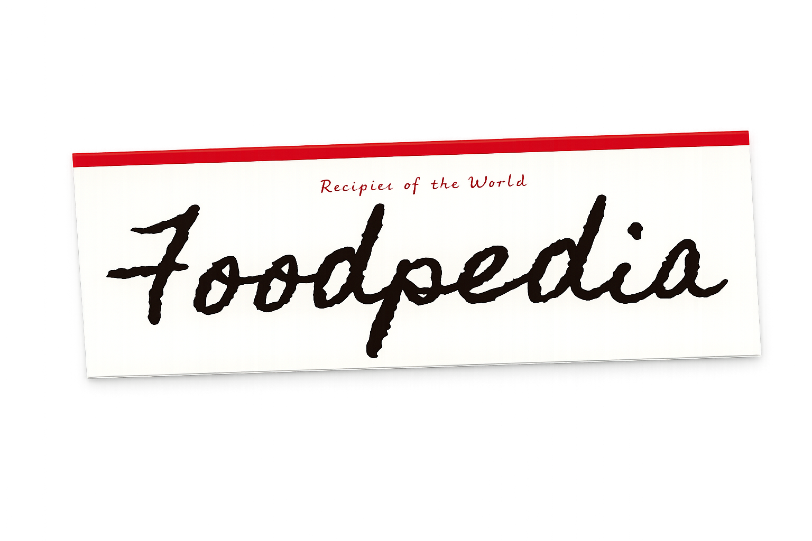

[](./README.pt-BR.md)

<br>

<p align="center">
  
</p>

<p align="center">
  <em>a culinary encyclopedia that looks, feels, and flips like a real book.</em>
</p>

<br>

<p align="center">
  
  
  
  
  
  
  
  <a href="https://foodpedia-three.vercel.app"></a>
</p>

<p align="center">
  <a href="#about">About</a> &nbsp;·&nbsp;
  <a href="#features">Features</a> &nbsp;·&nbsp;
  <a href="#ai-providers">AI Providers</a> &nbsp;·&nbsp;
  <a href="#getting-started">Getting Started</a> &nbsp;·&nbsp;
  <a href="#usage">Usage</a> &nbsp;·&nbsp;
  <a href="#roadmap">Roadmap</a> &nbsp;·&nbsp;
  <a href="#support-me">Support</a>
</p>

---

<p align="center">
  
</p>

<p align="center">
  <em>The book opening and turning pages — all animations, no framework.</em>
</p>

<br>

<table align="center">
  <tr>
    <td align="center">
      
      <br><em>Closed cover</em>
    </td>
    <td align="center">
      
      <br><em>Table of contents</em>
    </td>
  </tr>
  <tr>
    <td align="center">
      
      <br><em>Search spread</em>
    </td>
    <td align="center">
      
      <br><em>AI-generated result</em>
    </td>
  </tr>
  <tr>
    <td align="center">
      
      <br><em>Classic recipe spread</em>
    </td>
    <td align="center">
      
      <br><em>Endpaper + title page</em>
    </td>
  </tr>
</table>

> **Mobile:** responsive layout is actively being improved. Desktop is the primary experience for now.

---

## about

Recipe websites bury the actual recipe under autoplay videos, pop-up newsletters, and three paragraphs about someone's grandmother. Foodpedia does the opposite: everything goes inside a book — an actual book you open and flip through — where each dish gets its own spread and nothing competes for your attention.

It started as a university project at PUCPR (grade 10/10). The concept held up well enough to keep going: it now supports Ollama for fully local on-device generation, Gemini API as a cloud alternative, and ships with a static Vercel demo that needs no server at all.

Zero cloud lock-in. Zero framework overhead. Zero compromise on the physical feel.

> If you landed here as a recruiter or curious developer: this project is a showcase of frontend craftsmanship — complex GSAP animations, a custom design system, and AI integration, all built with nothing but HTML, CSS, vanilla JS, and Python.

---

## features

**Physical book interface — no framework, no shortcuts**
The entire app lives in one Jinja2 template. The book metaphor demanded direct control over every pixel and every transition — no React, no Tailwind, no component library. Just DOM and intent.

**Animated page turns with GSAP**
Transitions use a `scaleX` curtain instead of CSS 3D flips — more reliable across browsers, more controllable per spread. Each page has its own GSAP timeline. (Yes, this took embarrassingly long to tune. Yes, it was worth it.)

<p align="center"></p>

**AI recipe generation — two providers**
- **Ollama** — run any local model (gemma3, llama3, whatever fits your machine). No cloud, no cost, no data leaving your device.
- **Gemini API** — Google's free tier if you want AI from anywhere without installing a local model.
- Both route through the same Flask endpoint. The book doesn't know which one answered.

**Typography as narrative**
Five fonts. Five generations of a fictional family who contributed to the book. Homemade Apple for the original printer's handwriting. Indie Flower for the cook who scribbled notes in the margins. The typography tells you who wrote each section before you read a word.

<p align="center"></p>

**Paper grain without a texture file**
A live `<feTurbulence>` SVG filter at 4% opacity on the body gives the app an aged-paper feel. Scales perfectly, weighs nothing, works everywhere.

**Botanical SVG illustrations — stroke only**
All decorations are inline SVG (via Jinja2 ``), drawn in gold with no fill. They live in the DOM, cost almost nothing to load, and stay sharp at any resolution.

**Onboarding that fits the metaphor**
New users go through a "Como Usar" tutorial built as real book spreads. Side tabs unlock automatically as you flip through them — no buttons, no confirmation screen. The book teaches you to read the book.

**Static export for Vercel (and anywhere else)**
A build script exports the full interface as a standalone `index.html` for demos that need no server. Classic recipes work; AI search doesn't — that would require a backend, obviously.

---

## ai providers

| | provider | setup | free | best for |
|--|----------|-------|------|----------|
| ◆ | **demo** | none | always | quick look, no install |
| ◆ | **gemini** | API key | free tier | access from anywhere |
| ◆ | **ollama** | local install | unlimited | offline, privacy-first |

Get a Gemini key at [aistudio.google.com](https://aistudio.google.com/apikey) · check [Gemini rate limits](https://ai.google.dev/gemini-api/docs/rate-limits) · get Ollama at [ollama.com](https://ollama.com)

Keys stay in `.env` on the backend — the frontend never touches them.

---

## getting started

```bash
# Clone and enter the project
git clone https://github.com/ltcmnk/foodpedia.git
cd foodpedia

# Create and activate a virtual environment
python3 -m venv .venv
source .venv/bin/activate      # Windows: .venv\Scripts\activate

# Install dependencies
pip install -r requirements.txt

# Copy the environment template
cp .env.example .env
```

Edit `.env` for the mode you want:

```bash
# Demo — no AI, no setup required
DEMO_MODE=true

# Gemini — cloud AI
DEMO_MODE=false
AI_PROVIDER=gemini
GEMINI_API_KEY=your_key_here

# Ollama — fully local
DEMO_MODE=false
AI_PROVIDER=ollama
OLLAMA_HOST=http://localhost:11434
OLLAMA_MODEL=gemma3:latest
```

> **Ollama users:** install from [ollama.com](https://ollama.com) first, then pull a model:
> ```bash
> ollama pull gemma3
> ```

```bash
# Run
flask run --port 5001
# Open http://localhost:5001
```

To rebuild the static Vercel demo after template or style changes:

```bash
python3 scripts/build_static_demo.py
```

---

## usage

1. **Open the book** — the cloth cover animates open to the table of contents
2. **Flip through the tutorial** — "Como Usar" spreads walk you through the interface; side tabs unlock automatically as you pass through them
3. **Browse hardcoded recipes** — flip through the book or jump via tab navigation
4. **Search any dish** — type a name in the search spread; the AI generates a full recipe spread in real time
5. **Flip back and compare** — the generated spread lives in the book alongside the classics, formatted identically

---

## configuration

| Variable | Type | Default | Description |
|----------|------|---------|-------------|
| `DEMO_MODE` | bool | `false` | Serve static recipes only, no AI calls |
| `AI_PROVIDER` | string | `ollama` | `ollama` or `gemini` |
| `OLLAMA_HOST` | string | `http://localhost:11434` | Ollama server URL |
| `OLLAMA_MODEL` | string | `gemma3:latest` | Model name to use |
| `GEMINI_API_KEY` | string | — | Your Google AI Studio API key |

---

## api

| method | endpoint | description |
|--------|----------|-------------|
| `GET` | `/api/health` | provider status check |
| `GET` | `/api/models` | list available models per provider |
| `POST` | `/api/recipe` | generate a recipe from a dish name |

```bash
curl -X POST http://localhost:5001/api/recipe \
  -H "Content-Type: application/json" \
  -d '{"dish": "feijoada", "provider": "demo"}'
```

---

## structure

```text
foodpedia/
├── app/
│   ├── routes/        # API and page routes
│   └── services/      # AI router · Ollama · Gemini · demo
├── static/            # CSS, JS, recipe data
├── templates/         # Jinja2 HTML + SVG illustrations
├── docs/              # README assets
├── scripts/           # Static demo export
├── index.html         # Generated static build (Vercel demo)
├── app.py
└── .env.example
```

---

## roadmap

- [x] Skeuomorphic book interface (HTML + CSS + GSAP, zero frameworks)
- [x] AI recipe generation via Ollama (local, offline)
- [x] Gemini API integration (cloud alternative)
- [x] Demo mode — works with no AI configured
- [x] Static export (deployed on Vercel)
- [x] Onboarding tutorial built as book spreads
- [x] Export recipe spread as printable PDF (press `P`)
- [x] Save and bookmark recipes across sessions (localStorage)
- [x] Classic recipes across cuisines (18 dishes, 10+ countries)
- [x] Keyboard navigation for page turns (← → PageUp PageDown)
- [ ] Recipe image generation via AI

---

## built with

- [Flask](https://flask.palletsprojects.com/) + Jinja2 — lightweight Python backend, single template serves the whole book
- [GSAP 3.12](https://gsap.com/) — all animations: page turns, spread transitions, tab interactions, onboarding
- [Ollama](https://ollama.com/) — on-device LLM inference, no cloud required
- [Google Gemini API](https://ai.google.dev/) — cloud AI alternative with free tier
- [Google Fonts](https://fonts.google.com/) — Homemade Apple, Indie Flower, EB Garamond, Playfair Display, Lora

---

## support me

Foodpedia is a personal project built with care. If it helped you, inspired you, or you just want to see it keep going — any support is genuinely appreciated.

<p align="center">
  <a href="https://ko-fi.com/ltcmnk">
    
  </a>
  &nbsp;
  <a href="https://livepix.gg/ltcmnk">
    
  </a>
  &nbsp;
  <a href="https://github.com/sponsors/ltcmnk">
    
  </a>
</p>

<p align="center">
  Can't donate? A <strong>⭐ star on this repo</strong> goes a long way — it helps others find the project and keeps the motivation alive.
</p>

---

## contributing

This is a personal project. Issues and ideas are welcome, but I'm not actively reviewing PRs at the moment. If something is broken, open an issue and I'll take a look.

---

## license

[MIT](./LICENSE) — do whatever you want with it.

---

<p align="center">
  <em>started as an academic project at PUCPR · still going.</em>
  <br><br>
  made by <a href="https://ltcmnk.github.io/portfolio">letícia miniuk</a> &nbsp;·&nbsp;
  <a href="https://github.com/ltcmnk">github.com/ltcmnk</a> &nbsp;·&nbsp;
  <a href="https://linkedin.com/in/letcmnk">linkedin.com/in/letcmnk</a>
</p>
