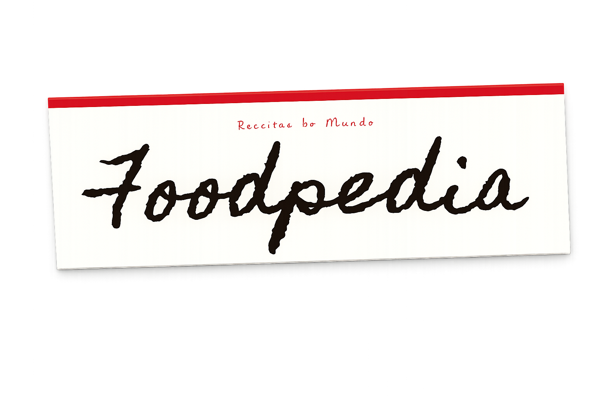
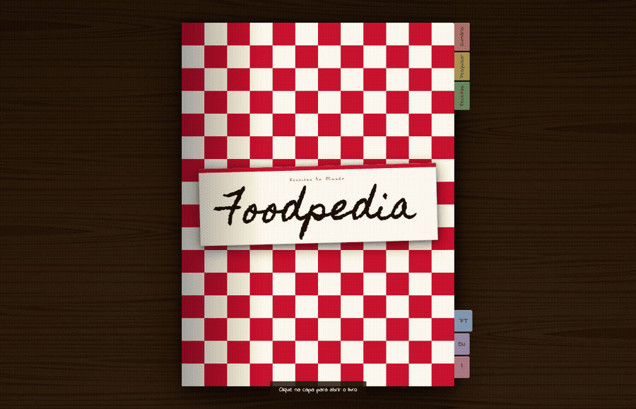
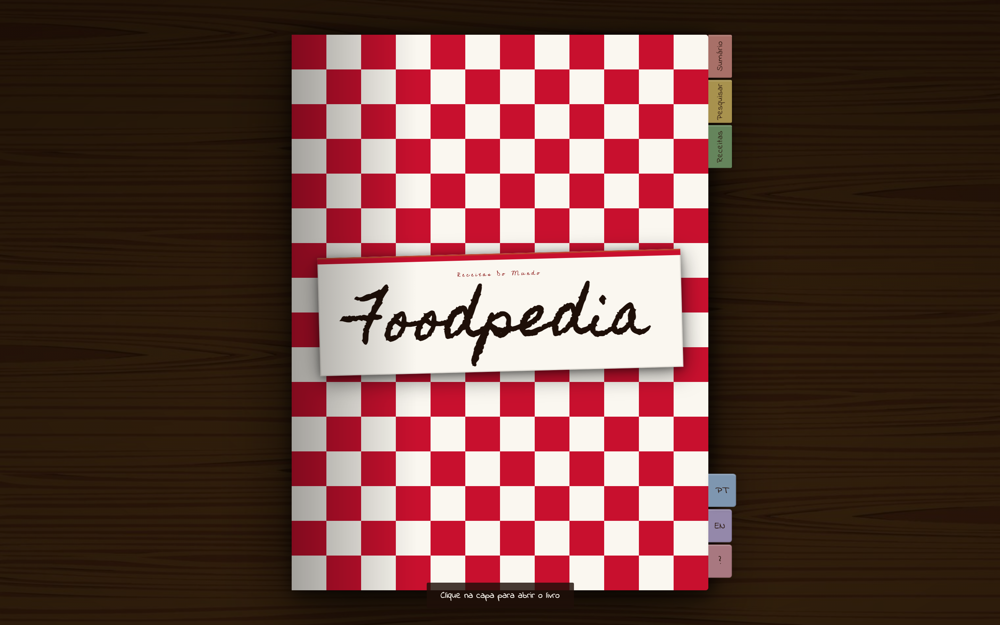
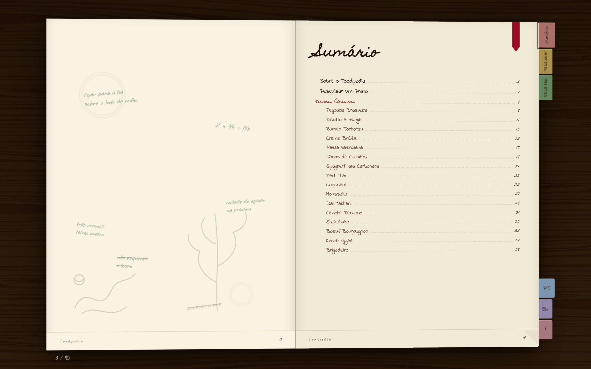
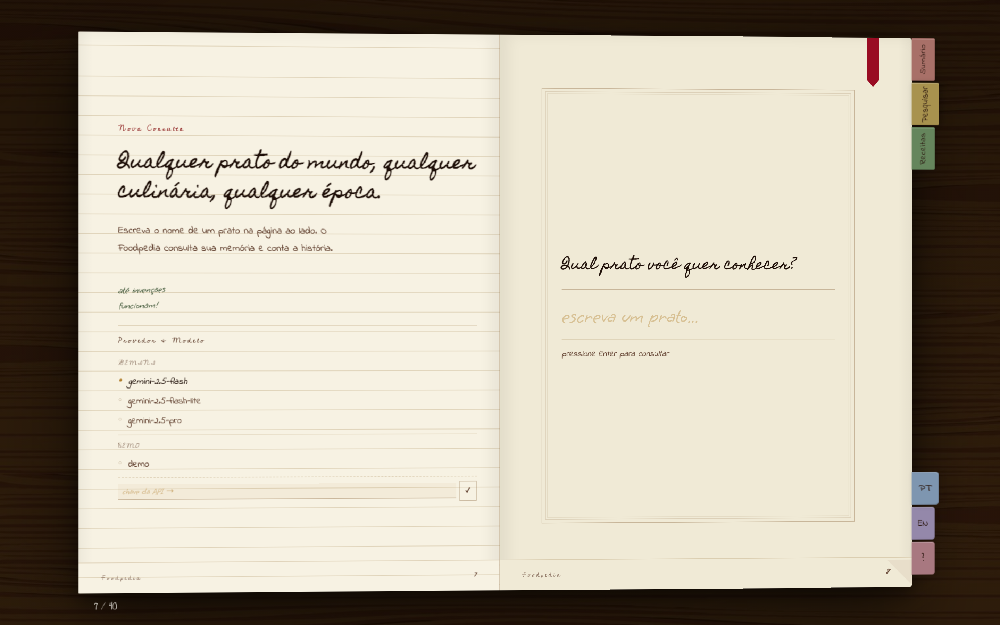
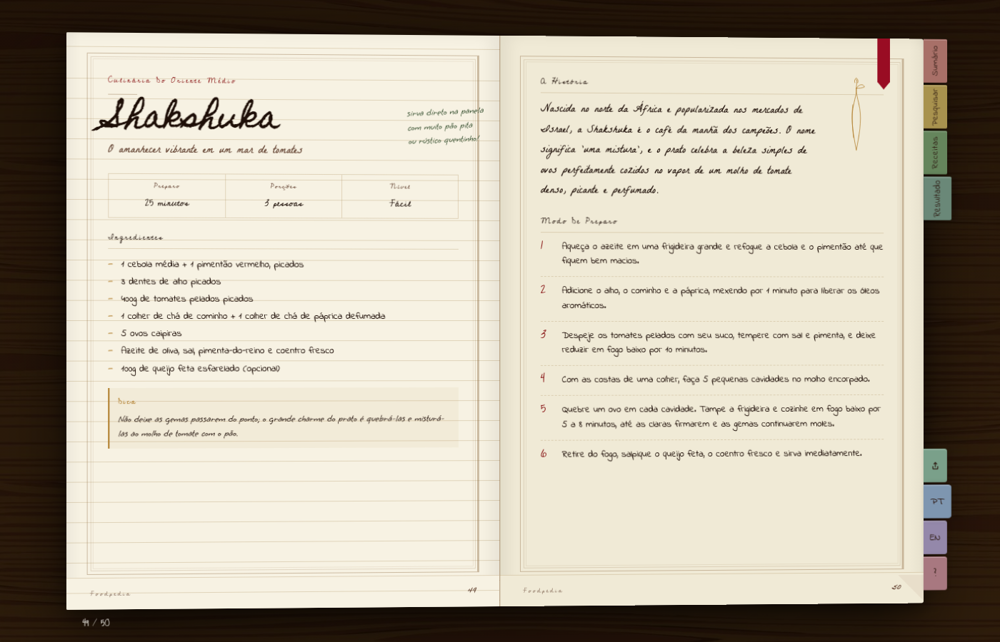
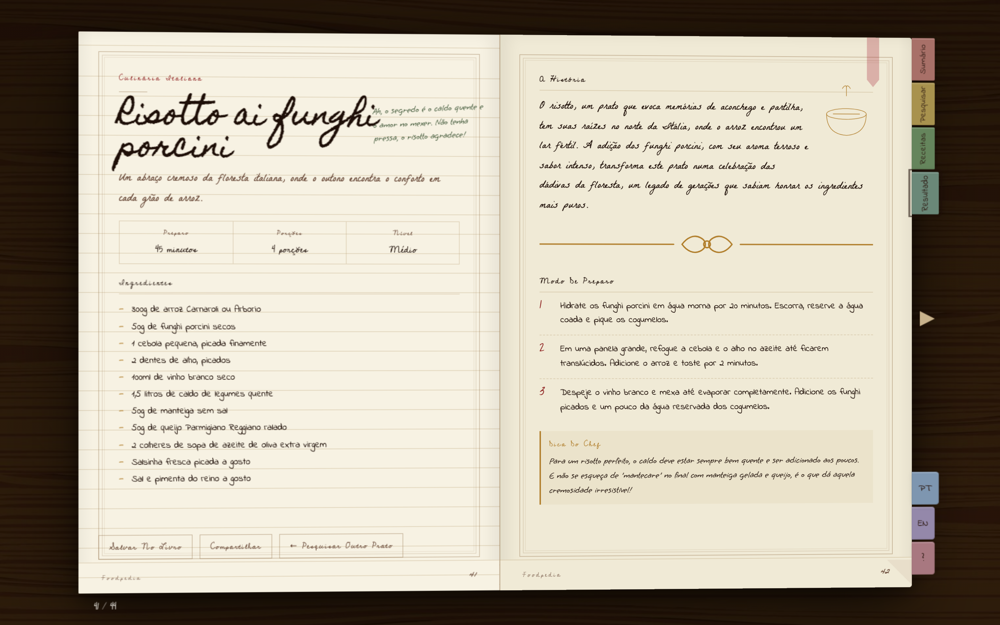
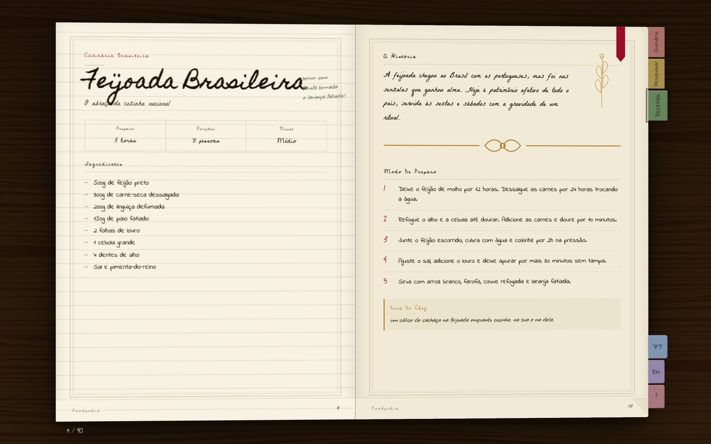

[](./README.md)

<br>

<p align="center">
  
</p>

<p align="center">
  <em>uma enciclopédia culinária que parece, sente e vira como um livro de verdade.</em>
</p>

<br>

<p align="center">
  
  
  
  
  
  
  
  <a href="https://foodpedia-three.vercel.app"></a>
</p>

<p align="center">
  <a href="#sobre">Sobre</a> &nbsp;·&nbsp;
  <a href="#funcionalidades">Funcionalidades</a> &nbsp;·&nbsp;
  <a href="#providers-de-ia">Providers de IA</a> &nbsp;·&nbsp;
  <a href="#como-rodar">Como Rodar</a> &nbsp;·&nbsp;
  <a href="#uso">Uso</a> &nbsp;·&nbsp;
  <a href="#roadmap">Roadmap</a> &nbsp;·&nbsp;
  <a href="#apoie-o-projeto">Apoio</a>
</p>

---

<p align="center">
  
</p>

<p align="center">
  <em>O livro abrindo e virando páginas — tudo animado, sem framework.</em>
</p>

<br>

<table align="center">
  <tr>
    <td align="center">
      
      <br><em>Capa fechada</em>
    </td>
    <td align="center">
      
      <br><em>Sumário</em>
    </td>
  </tr>
  <tr>
    <td align="center">
      
      <br><em>Spread de busca</em>
    </td>
    <td align="center">
      
      <br><em>Resultado da IA</em>
    </td>
  </tr>
  <tr>
    <td align="center">
      
      <br><em>Receita clássica</em>
    </td>
    <td align="center">
      
      <br><em>Endpaper + folha de rosto</em>
    </td>
  </tr>
</table>

> **Mobile:** o layout responsivo está em melhoria contínua. A experiência principal por enquanto é em desktop.

---

## sobre

Sites de receita enterram a receita de verdade embaixo de vídeo com autoplay, pop-up de newsletter e três parágrafos sobre a avó da autora antes de chegar nos ingredientes. O Foodpedia faz o oposto: tudo vai pra dentro de um livro — um livro de verdade que você abre e vira as páginas — onde cada prato tem seu spread e nada está disputando sua atenção.

Começou como projeto de disciplina na PUCPR (nota 10). A ideia se sustentou bem o suficiente pra continuar evoluindo: hoje suporta Ollama para geração local no próprio dispositivo, Gemini API como alternativa na nuvem, e tem uma versão estática no Vercel que não precisa de servidor.

Sem lock-in. Sem framework. Sem compromisso com a sensação física.

> Se você chegou aqui como recrutador ou por curiosidade: este projeto é um showcase de desenvolvimento frontend — animações complexas com GSAP, sistema de design próprio e integração com IA, tudo feito com HTML, CSS, JS vanilla e Python.

---

## funcionalidades

**Interface de livro físico — sem framework, sem atalho**
O app inteiro é um template Jinja2. A metáfora do livro exige controle direto sobre cada pixel e cada transição — sem React, sem Tailwind, sem biblioteca de componentes. Só DOM e intenção.

**Viradas de página animadas com GSAP**
As transições usam animação de cortina `scaleX` em vez de CSS 3D flip — mais estável entre browsers, mais controlável por spread. Cada página tem sua própria timeline GSAP. (Sim, demorou absurdamente pra calibrar. Sim, valeu.)

<p align="center"></p>

**Geração de receitas com IA — dois providers**
- **Ollama** — rode qualquer modelo local (gemma3, llama3, o que couber na sua máquina). Sem nuvem, sem custo, sem dado saindo do dispositivo.
- **Gemini API** — tier gratuito do Google se você quiser IA de qualquer lugar sem instalar modelo local.
- Os dois passam pelo mesmo endpoint Flask. O livro não sabe qual respondeu.

**Tipografia como narrativa**
Cinco fontes. Cinco gerações de uma família fictícia que contribuíram pro livro. Homemade Apple para a caligrafia do impressor original. Indie Flower para a cozinheira que rabiscou anotações nas margens. A tipografia já te diz quem escreveu cada seção antes de você ler uma palavra.

<p align="center"></p>

**Grão de papel sem arquivo de textura**
Um filtro SVG `<feTurbulence>` ao vivo com 4% de opacidade no body dá ao app aquela sensação de papel envelhecido. Escala perfeitamente, não pesa nada, funciona em todo lugar.

**Ilustrações botânicas SVG — só contorno**
Todas as decorações são SVG inline (via `` do Jinja2), desenhadas em dourado sem preenchimento. Vivem no DOM, custam quase nada pra carregar e ficam nítidas em qualquer resolução.

**Onboarding dentro da metáfora**
Novos usuários passam por um tutorial "Como Usar" construído como spreads reais do livro. As abas laterais ficam bloqueadas até o tutorial terminar. O livro te ensina a ler o livro.

**Export estático para o Vercel (e qualquer servidor estático)**
Um script de build exporta a interface completa como `index.html` standalone para demos que não precisam de servidor. Receitas fixas funcionam; busca com IA não — isso exigiria backend, obviamente.

---

## providers de ia

| | provider | configuração | gratuito | melhor para |
|--|----------|--------------|----------|-------------|
| ◆ | **demo** | nenhuma | sempre | olhar rápido, sem instalar |
| ◆ | **gemini** | chave de API | plano gratuito | acesso de qualquer lugar |
| ◆ | **ollama** | instalação local | ilimitado | uso offline e privado |

Chave Gemini em [aistudio.google.com](https://aistudio.google.com/apikey) · limites em [ai.google.dev/gemini-api/docs/rate-limits](https://ai.google.dev/gemini-api/docs/rate-limits) · Ollama em [ollama.com](https://ollama.com)

As chaves ficam só no `.env` do backend — o frontend nunca as acessa.

---

## como rodar

```bash
# Clonar e entrar no projeto
git clone https://github.com/ltcmnk/foodpedia.git
cd foodpedia

# Criar e ativar o ambiente virtual
python3 -m venv .venv
source .venv/bin/activate      # Windows: .venv\Scripts\activate

# Instalar dependências
pip install -r requirements.txt

# Copiar o template de variáveis de ambiente
cp .env.example .env
```

Edite o `.env` para o modo que você quer:

```bash
# Demo — sem IA, sem configuração
DEMO_MODE=true

# Gemini — IA na nuvem
DEMO_MODE=false
AI_PROVIDER=gemini
GEMINI_API_KEY=sua_chave_aqui

# Ollama — 100% local
DEMO_MODE=false
AI_PROVIDER=ollama
OLLAMA_HOST=http://localhost:11434
OLLAMA_MODEL=gemma3:latest
```

> **Usuários do Ollama:** instale em [ollama.com](https://ollama.com) primeiro, depois baixe o modelo:
> ```bash
> ollama pull gemma3
> ```

```bash
# Rodar
flask run --port 5001
# Abra http://localhost:5001
```

Para reconstruir a demo estática do Vercel depois de mudar template, CSS ou JS:

```bash
python3 scripts/build_static_demo.py
```

---

## uso

1. **Abra o livro** — a capa de tecido anima e abre no sumário
2. **Complete o tutorial** — os spreads "Como Usar" guiam pela interface; as abas desbloqueiam depois
3. **Navegue pelas receitas fixas** — vire as páginas ou use a navegação por abas
4. **Busque qualquer prato** — digite um nome no spread de busca; a IA gera um spread completo em tempo real
5. **Volte e compare** — o spread gerado fica no livro junto com os clássicos, formatado de forma idêntica

---

## configuração

| Variável | Tipo | Padrão | Descrição |
|----------|------|--------|-----------|
| `DEMO_MODE` | bool | `false` | Serve só receitas estáticas, sem chamar IA |
| `AI_PROVIDER` | string | `ollama` | `ollama` ou `gemini` |
| `OLLAMA_HOST` | string | `http://localhost:11434` | URL do servidor Ollama |
| `OLLAMA_MODEL` | string | `gemma3:latest` | Nome do modelo a usar |
| `GEMINI_API_KEY` | string | — | Sua chave da Google AI Studio |

---

## api

| método | endpoint | descrição |
|--------|----------|-----------|
| `GET` | `/api/health` | status do provider atual |
| `GET` | `/api/models` | modelos disponíveis por provider |
| `POST` | `/api/recipe` | gera uma receita a partir de um prato |

```bash
curl -X POST http://localhost:5001/api/recipe \
  -H "Content-Type: application/json" \
  -d '{"dish": "feijoada", "provider": "demo"}'
```

---

## estrutura

```text
foodpedia/
├── app/
│   ├── routes/        # rotas da API e das páginas
│   └── services/      # router de IA · Ollama · Gemini · demo
├── static/            # CSS, JS, dados de receitas
├── templates/         # HTML Jinja2 + ilustrações SVG
├── docs/              # assets do README
├── scripts/           # export da demo estática
├── index.html         # build estática gerada (demo no Vercel)
├── app.py
└── .env.example
```

---

## roadmap

- [x] Interface de livro skeuomórfico (HTML + CSS + GSAP, zero frameworks)
- [x] Geração de receitas via Ollama (local, offline)
- [x] Integração com Gemini API (alternativa na nuvem)
- [x] Modo demo — funciona sem nenhuma IA configurada
- [x] Export estático (deploy no Vercel)
- [x] Tutorial de onboarding construído como spreads do livro
- [x] Exportar spread de receita como PDF imprimível (tecla `P`)
- [x] Salvar e favoritar receitas entre sessões (localStorage)
- [x] Receitas clássicas de várias culinárias (18 pratos, 10+ países)
- [x] Navegação por teclado para virar páginas (← → PageUp PageDown)
- [ ] Geração de imagem da receita via IA

---

## feito com

- [Flask](https://flask.palletsprojects.com/) + Jinja2 — backend Python leve, um template serve o livro inteiro
- [GSAP 3.12](https://gsap.com/) — todas as animações: viradas de página, transições de spread, abas, onboarding
- [Ollama](https://ollama.com/) — inferência de LLM no dispositivo, sem nuvem
- [Google Gemini API](https://ai.google.dev/) — alternativa na nuvem com plano gratuito
- [Google Fonts](https://fonts.google.com/) — Homemade Apple, Indie Flower, EB Garamond, Playfair Display, Lora

---

## apoie o projeto

O Foodpedia é um projeto pessoal feito com carinho. Se ele te ajudou, te inspirou ou você só quer ver ele continuar — qualquer forma de apoio é muito bem-vinda.

<p align="center">
  <a href="https://ko-fi.com/ltcmnk">
    
  </a>
  &nbsp;
  <a href="https://livepix.gg/ltcmnk">
    
  </a>
  &nbsp;
  <a href="https://github.com/sponsors/ltcmnk">
    
  </a>
</p>

<p align="center">
  Não pode contribuir financeiramente? Uma <strong>⭐ estrela no repositório</strong> já ajuda muito — ela faz outras pessoas encontrarem o projeto e mantém a motivação lá em cima.
</p>

---

## contribuição

Este é um projeto pessoal. Issues e ideias são bem-vindas, mas não estou revisando PRs ativamente no momento. Se algo estiver quebrado, abre uma issue que eu dou uma olhada.

---

## licença

[MIT](./LICENSE) — faz o que quiser.

---

<p align="center">
  <em>começou como projeto acadêmico na PUCPR · ainda vai longe.</em>
  <br><br>
  feito por <a href="https://ltcmnk.github.io/portfolio">letícia miniuk</a> &nbsp;·&nbsp;
  <a href="https://github.com/ltcmnk">github.com/ltcmnk</a> &nbsp;·&nbsp;
  <a href="https://linkedin.com/in/letcmnk">linkedin.com/in/letcmnk</a>
</p>
